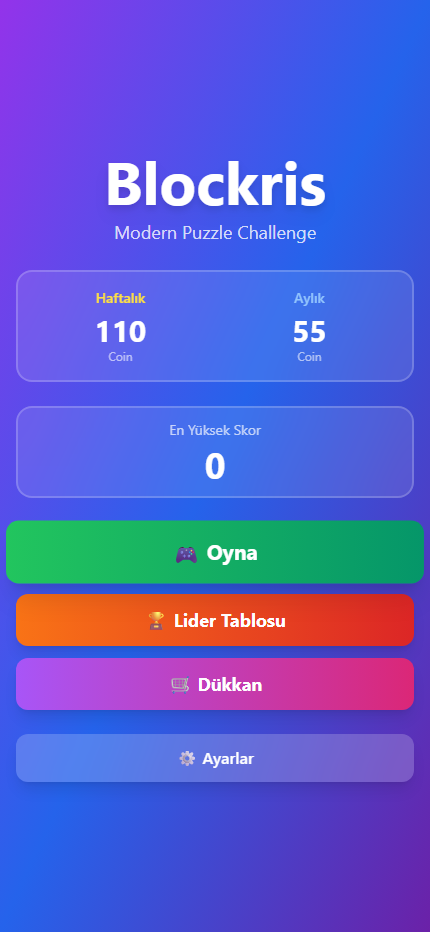
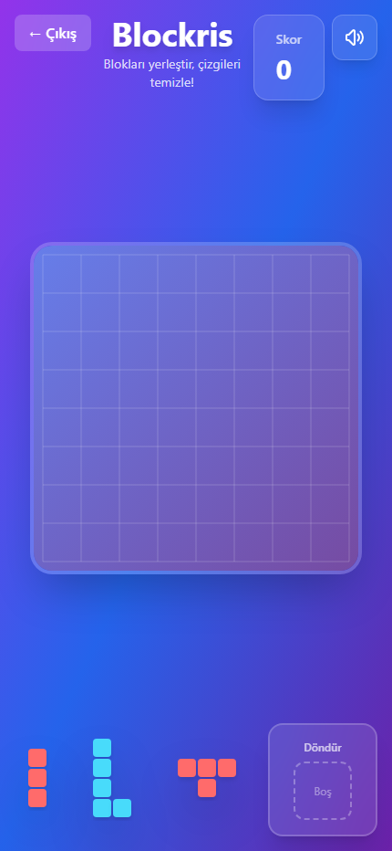
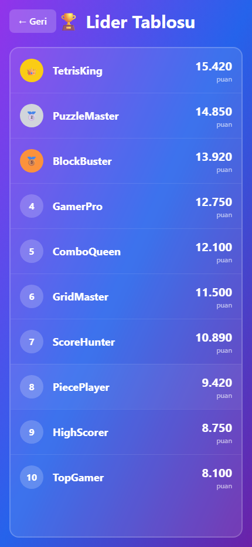
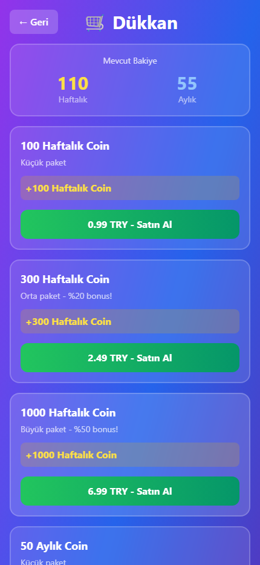
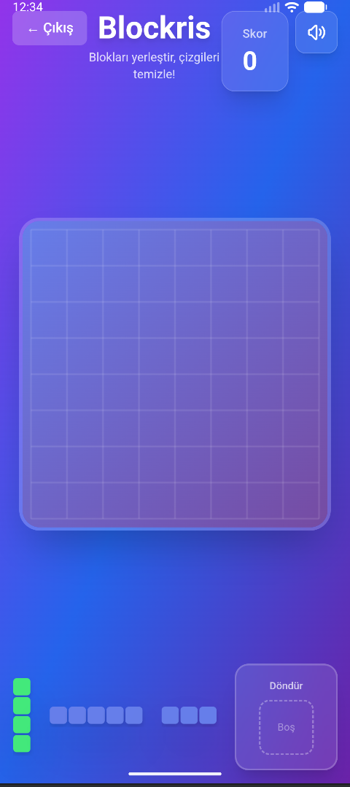

# Blockris 🎮

Modern blok yerleştirme oyunu - Tetris meets Sudoku!

**Now available for Android and iOS!** 📱

---

## 📸 Ekran Görüntüleri / Screenshots

### 🎬 Demo Video
<p align="center">
  <video src="images/blockris_demo.webm" width="300" autoplay loop muted>
    Tarayıcınız video etiketini desteklemiyor.
  </video>
</p>

> Oyun demo kaydı: Ana menü → Oyun ekranı → Lider tablosu → Dükkan akışı.

### Ana Menü
<p align="center">
  
</p>

> Ana menü: Oyna, Lider Tablosu, Dükkan ve Ayarlar butonları ile coin bilgisi ve en yüksek skor gösterimi.

### Oyun Ekranı
<p align="center">
  
</p>

> 8x8 grid üzerinde blok yerleştirme oynanışı. Alt barda 3 farklı parça ve Döndür (Rotate Slot) alanı.

### Lider Tablosu
<p align="center">
  
</p>

> Online sıralama tablosu ile oyuncuların puanlarını karşılaştırma.

### Dükkan
<p align="center">
  
</p>

> Haftalık ve aylık coin paketleri ile in-app satın alma ekranı.

### Mobil Görünüm
<p align="center">
  
</p>

> iOS/Android native uygulama görünümü - tam responsive tasarım.

---

## Oyun Kuralları

### Oyun Alanı
- **Grid Boyutu**: 8x8 hücre
- Her hücre kare şeklinde, modern gradient arka plan

### Parçalar (Pieces)
- Her turda **3 parça** alt barda görünür
- Parçalar 1-5 bloklu polinominolar (10+ çeşit)
- Parçalar **90° döndürülebilir** (Rotate Slot kullanarak)

### Oynanış
1. Alt bardaki 3 parçadan birini **Rotate Slot**'a sürükleyin (otomatik 90° döner)
2. Parçayı grid'e sürükleyip yerleştirin
3. Tam dolu **satırlar ve sütunlar** otomatik temizlenir
4. 3 parça da bitince yeni 3'lü set gelir
5. Rotate Slot her yeni sette temizlenir

### Skor Sistemi
- **Yerleştirme Puanı**: Blok sayısı × 1
- **Çizgi Temizleme**: İlk çizgi +10, her ek çizgi +5
- **Kombo Çarpanı (Round-Based)**: 1 + (kombo × 0.25)
  - İlk 2 round'da kombo sayılmaz (ısınma turu)
  - 3. round'dan itibaren combo başlar
  - Bir round'da hiç satır/sütun temizlenmezse kombo sıfırlanır
  - Herhangi bir parça satır/sütun temizlerse kombo devam eder
- **Tüm Grid Temizliği**: +1000 bonus + renk paleti değişir

### Oyun Bitişi
Hiçbir parçanın hiçbir rotasyonda grid'e sığmaması durumunda **Game Over**

## Kurulum ve Çalıştırma

### Web Geliştirme

```bash
# Bağımlılıkları yükle
npm install

# Geliştirme sunucusunu başlat
npm run dev

# Build al
npm run build

# Build'i önizle
npm run preview
```

Oyun http://localhost:3000 adresinde çalışacaktır.

### Mobil Uygulama (Android & iOS)

```bash
# Web build + mobil platform sync
npm run build:mobile

# Android Studio'da aç
npm run build:android

# Xcode'da aç (macOS gerekli)
npm run build:ios

# Sadece sync (kod değişikliklerinden sonra)
npm run sync
```

**Store'lara yayınlama için**: [DEPLOYMENT.md](DEPLOYMENT.md) dosyasına bakın.

## Teknolojiler

- **React 18** + **TypeScript**
- **Vite** (hızlı build tool)
- **Tailwind CSS** (modern gradient'ler)
- **HTML5 Canvas** (oyun rendering)
- **Capacitor** (native mobile app framework)
- **PWA** desteği (offline çalışma)
- **Haptic Feedback** (mobil cihazlarda titreşim)
- **Web Audio API** (oyun sesleri)

## Özellikler

✅ **8x8 grid sistemi** (optimize for mobile)
✅ **10+ farklı parça çeşidi**
✅ **Rotate Slot** (90° döndürme)
✅ **Satır/Sütun temizleme**
✅ **Round-based combo sistemi** (ilk 2 round ısınma)
✅ **Tüm grid temizliği bonusu** (+1000 puan + renk değişimi)
✅ **Offset-based drag & drop** (tıkladığın kare yerleşir)
✅ **Responsive tasarım**
✅ **Modern gradient UI**
✅ **Native mobil uygulama** (Android & iOS)
✅ **Haptic feedback** (titreşim)
✅ **Ses efektleri** (Web Audio API)
✅ **PWA desteği** (offline çalışma)
✅ **Splash screen & app icons**
✅ **Production-ready** (store'lara hazır)

## Geliştirme Durumu

### Tamamlanan ✅
- Proje kurulumu
- Oyun mantığı (grid, pieces, placement, line clearing)
- Round-based combo sistemi
- UI bileşenleri (GameBoard, PieceBar, RotateSlot, Modals)
- Canvas rendering
- Offset-based drag & drop
- Mobil optimizasyon (Capacitor)
- Haptic feedback
- Ses efektleri
- PWA konfigürasyonu
- Store deployment hazırlığı

### Planlanan 📋
- Animasyonlar (smooth line clearing)
- Particle effects
- Leaderboard (online/offline)
- Analytics integration
- Reklam entegrasyonu (AdMob)
- In-app purchases

## Lisans

MIT

---

**Yaratıcı**: Blockris Ekibi
**Tarih**: 2025
**Versiyon**: 1.0.0 MVP
